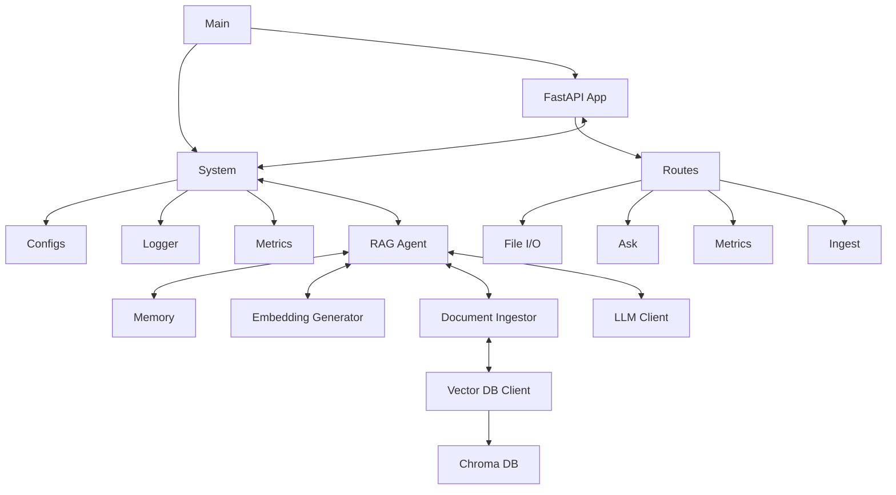
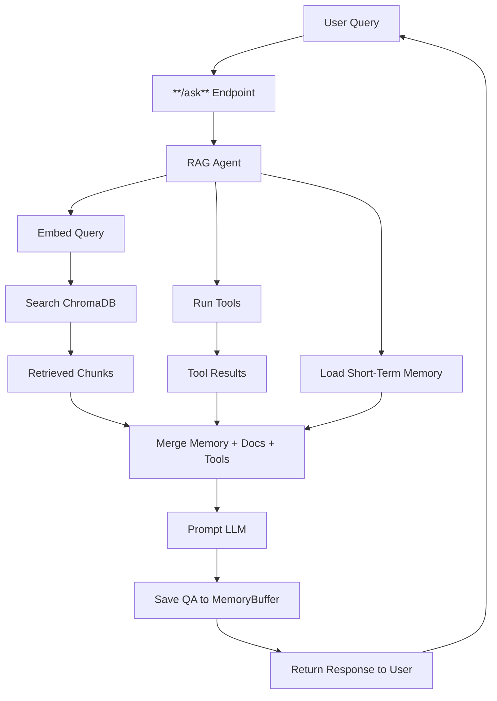

# Research Assistant
A light weight memory-augmented RAG application **Research Assistant** built with **FastAPI**, **Ollama**, **ChromaDB** and **Transformers**. Supports *Persistent Memory*, *Tooling* and *Docker Deployment*. 
## Features 
- :white_check_mark: Switchable LLM Backends (**Ollama** / **Llama CPP**) via. **.env** configurations.
- :white_check_mark: Tool calling support. (Currently implemented **Wikipedia** search.)
- :white_check_mark: Streaming response supported via. *websockets*

  <details><summary><strong>See how to test streaming response!</strong></summary> 
    <code> After the application runs successfully, just open `socket_tester.html` from the root directory! </code>
    </details>
- :white_check_mark: File upload / clear support. Embedding generation.
- :white_check_mark: Multi-stage docker builds for reduction of image size.
- :white_check_mark: Data ingested with **incremental upsert** and option to *overwrite*.
- :white_check_mark: Custom RAG Agent orchestration with memory augmentation. 
- :white_check_mark: `/metrics` API with **Prometheus Client**
- :white_check_mark: **Make** commands available to run app in docker / generate deployable docker image. (internally uses *docker compose*)
- **~850MB** final fully initialized *docker image* size for easy deployment stable usage even in low spec machines.
- :white_check_mark: Custom embedder support.
  <details><summary><strong> Important notice regarding embedders</strong></summary>
    <p> A valid onnx encoder bundle must be present in the <code>/encoders</code> directory under same model name (as set in <strong>.env</strong>). By default the *all-MiniLM-L6-v2-onnx* is present in the encoders directory. Must include <code> .onnx</code>, <code>config.json</code>etc.</p>
  </details>
- :white_check_mark: Fast low latency response
- :white_check_mark: Rotating Logfile generation
- :white_check_mark: Unit tests with **85% Coverage!**. 
  <details>
    <summary><strong>Click to view latest coverage table</strong></summary>
    <br/>
    <table>
      <thead>
        <tr>
          <th>File</th>
          <th>Miss</th>
          <th>Fail</th>
          <th>Skip</th>
          <th>Coverage</th>
        </tr>
      </thead>
      <tbody>
        <tr><td>src/__init__.py</td><td>0</td><td>0</td><td>0</td><td>100%</td></tr>
        <tr><td>src/agent/__init__.py</td><td>0</td><td>0</td><td>0</td><td>100%</td></tr>
        <tr><td>src/agent/rag_agent.py</td><td>42</td><td>0</td><td>0</td><td>100%</td></tr>
        <tr><td>src/agent/tools/__init__.py</td><td>0</td><td>0</td><td>0</td><td>100%</td></tr>
        <tr><td>src/agent/tools/tool_base.py</td><td>5</td><td>1</td><td>0</td><td>80%</td></tr>
        <tr><td>src/agent/tools/wikipedia_search_tool.py</td><td>15</td><td>2</td><td>0</td><td>87%</td></tr>
        <tr><td>src/api/__init__.py</td><td>0</td><td>0</td><td>0</td><td>100%</td></tr>
        <tr><td>src/api/app.py</td><td>17</td><td>2</td><td>0</td><td>88%</td></tr>
        <tr><td>src/api/constants.py</td><td>12</td><td>0</td><td>0</td><td>100%</td></tr>
        <tr><td>src/api/dependencies/__init__.py</td><td>0</td><td>0</td><td>0</td><td>100%</td></tr>
        <tr><td>src/api/dependencies/services.py</td><td>20</td><td>3</td><td>0</td><td>85%</td></tr>
        <tr><td>src/api/routes/__init__.py</td><td>0</td><td>0</td><td>0</td><td>100%</td></tr>
        <tr><td>src/api/routes/ask.py</td><td>47</td><td>9</td><td>0</td><td>81%</td></tr>
        <tr><td>src/api/routes/file_io.py</td><td>37</td><td>3</td><td>0</td><td>92%</td></tr>
        <tr><td>src/api/routes/ingest.py</td><td>42</td><td>10</td><td>0</td><td>76%</td></tr>
        <tr><td>src/api/routes/metrics.py</td><td>6</td><td>0</td><td>0</td><td>100%</td></tr>
        <tr><td>src/api/schemas/__init__.py</td><td>0</td><td>0</td><td>0</td><td>100%</td></tr>
        <tr><td>src/api/schemas/ask.py</td><td>7</td><td>0</td><td>0</td><td>100%</td></tr>
        <tr><td>src/config/__init__.py</td><td>0</td><td>0</td><td>0</td><td>100%</td></tr>
        <tr><td>src/config/config.py</td><td>36</td><td>0</td><td>0</td><td>100%</td></tr>
        <tr><td>src/ingestion/__init__.py</td><td>0</td><td>0</td><td>0</td><td>100%</td></tr>
        <tr><td>src/ingestion/document_ingestor.py</td><td>65</td><td>1</td><td>0</td><td>98%</td></tr>
        <tr><td>src/llm/llama_cpp_client.py</td><td>64</td><td>11</td><td>0</td><td>83%</td></tr>
        <tr><td>src/llm/llm_client_base.py</td><td>5</td><td>1</td><td>0</td><td>80%</td></tr>
        <tr><td>src/llm/ollama_client.py</td><td>40</td><td>0</td><td>0</td><td>100%</td></tr>
        <tr><td>src/store/__init__.py</td><td>0</td><td>0</td><td>0</td><td>100%</td></tr>
        <tr><td>src/store/memory_buffer.py</td><td>13</td><td>0</td><td>0</td><td>100%</td></tr>
        <tr><td>src/store/vector_store_client.py</td><td>33</td><td>1</td><td>0</td><td>97%</td></tr>
        <tr><td>src/utils/__init__.py</td><td>0</td><td>0</td><td>0</td><td>100%</td></tr>
        <tr><td>src/utils/embedding_generator.py</td><td>39</td><td>2</td><td>0</td><td>95%</td></tr>
        <tr><td>src/utils/initializer.py</td><td>24</td><td>24</td><td>0</td><td>0%</td></tr>
        <tr><td>src/utils/logger_config.py</td><td>22</td><td>22</td><td>0</td><td>0%</td></tr>
        <tr><td>src/utils/metrics.py</td><td>4</td><td>0</td><td>0</td><td>100%</td></tr>
        <tr><td><strong>Total</strong></td><td><strong>595</strong></td><td><strong>92</strong></td><td><strong>0</strong></td><td><strong>85%</strong></td></tr>
      </tbody>
    </table>
  </details>
   
- :white_check_mark: Ensured quality code with **mypy**, **ruff**/**pylint** and consistent formatting with **black**.
---
<br>

## Table of Contents

- [Features](#features)
- [Running The App](#running-the-app)
  - [Prerequisites](#prerequisites)
  - [Using Makefiles commands](#using-makefiles-commands)
  - [Running direct (Self Hosting)](#running-direct-self-hosting)
- [Configurations](#configurations)
- [System Architecture](#system-architecture)
  - [System Diagram](#system-diagram)
  - [System Description](#system-description)
    - [Main](#main)
    - [FastAPI App](#fastapi-app)
    - [System](#system)
    - [Retrieval-Augmented Generation (RAG) Agent](#retrieval-augmented-generation-rag-agent)
      - [RAG Workflow diagram](#rag-workflow-diagram)
      - [Overview](#overview)
      - [Responsibilities](#responsibilities)
      - [Why Custom RAG Agent?](#why-custom-rag-agent)
      - [Future Potential](#future-potential)
    - [MemoryBuffer](#memorybuffer)
      - [Overview](#overview-1)
      - [Features](#features-1)
      - [Example Output](#example-output)
    - [EmbeddingGenerator](#embeddinggenerator)
      - [Overview](#overview-2)
      - [Highlights](#highlights)
      - [Why ONNX?](#why-onnx)
    - [Vector DB Client](#vector-db-client)
      - [Overview](#overview-3)
      - [Responsibilities](#responsibilities-1)
      - [Key Methods](#key-methods)
      - [Future Ideas](#future-ideas)
    - [LLMClient](#llmclient)
      - [Overview](#overview-4)
      - [OllamaClient](#ollamaclient)
      - [LlamaCppClient](#llamacppclient)
      - [Future Enhancements](#future-enhancements)
- [Known Issues 🐞](#known-issues)
---
<br>

# Running The App 

**Make** configurations are available for running the app in **Docker**.
## Prerequisites
- **Docker** (Needed for using **Make** commands)
- **Make**
- **Ollama** (Optional)
- **Python 3** (Optional) 
- **LLM Module (.onnx)** (Needed to run using **LLAMA CPP**)

That's it. Build it and it can run **offline!**.

---
### Using Makefiles commands
 
```sh 
make dev
```
Initiates a *docker compose* to run the app based on **LLM_BACKEND** *.env* flag. (See `.env.example`)
 ```sh
 make dev-with-ollama-container
```
This will create separate containers for hosting **Ollama** and our app. They communicate internally. **Phi3** mini model is setup by default. *Entrypoint* scripts are setup and our app will wait for the *Ollama container* to be ready before starting the app. 

>[!NOTE]
>###### After creation the *Ollama container* will consume **~2.5GB**. This is separate from our app. LLM Modules can be supplied separately via the `/models` folder which is mounted during *docker compose*.


```sh 
make stop
```
- Remove *docker containers* and any *startup script**
```sh
make clean
```
- Stop and remove docker *containers* and *images* including any *volume mounts* 
```sh 
make create
```
- Create a *docker image* *.tar* file for deployment.
```sh
make test
```
- Generate an interactive version of the test coverage report. This requires dev-dependencies. Can be installed by `pip install -r dev-requirements.txt`.

>[!NOTE]
> To see the latest test result open `http://localhost:8002` after:
```sh
  cd ./htmlcov && python -m http-server 8002
```
- Trigger 
>[!CAUTION]
>##### If you are using the *"run"*  command,  you need to ensure that app container can access the *OLLAMA* URL (if using Ollama backend) or supply a `.gguf` LLM model to the `/models` directory (if using Llama CPP backend). For linux systems, this can be done by creating *config.toml* and adding the following in *$HOME_DIR/.ollama/config.toml* #####
```toml
[server]
listen = "0.0.0.0:11434"
```
---
### Running direct (Self Hosting)
You can also host the application locally. The project source code contains *requirements.txt* containing dependencies needed by the project.
- Create a *virtual env*	
  python -m venv .venv && source ./.venv/bin/activate
 - Install dependencies

 ```sh
 pip install -r requirements.txt
 ```
 - Tests are available and written with **pytest**. Install dev dependencies to run tests. 
 ```sh
 pip install -r dev-requirements.txt
 ```
 - Run the main module
  ```sh
  python -m main 
  ```
  **OR** 
  ```sh
  python ./main.py 
  ```
  (If you are on the *ROOT_DIR*)
 - System Logs are available in **/logs** folder.
##### To avoid any permissions issue, remove any */models* (models for llama cpp) or */chroma_db* (persistent vector storage) or /logs or /sample_data (has the documents to be searched) directories.

## Configurations

The project depends on user configurations. Use **.env** file to set configurations when running locally. 
**Makefile** commands internally use *docker compose* to setup containers. The environment variables can be set in 
***docker-compose.base.yaml***

#### Overview
- **LLM_BACKEND** - Responsible for switching backends!
- **LLAMA_CPP_MODEL_FILE** - A compatible LLM Model for **LLama CPP** if using this backend.
- **OLLAMA_CLIENT_URL** - If the **OLLAMA** backend is hosted in non-default url, can directly use it via this flag.

These flags are enough to switch backends and run the app.
There are other configurations (like deciding request timeout, context window etc). Check **.env.example** for available configs.

---

# System Architecture
This document outlines the system architecture for the application, including its main components and their interactions.

## System Diagram


## System Description

### Main ###
- The central entry point of the application. It can be run as module `python -m main`. If using *Makefiles*, will be used by *docker compose*.
---
### FastAPI App ###
- The API server `src/api/app.py`. Triggered by `main.py`
- Exposes REST endpoints via *routes*.
- View `Swagger UI` for exact EP and their schemas.
- Route files include:
  - `ASK` - Accepts natural language questions, calls RAG agent and returns responses.
  - `Ingest` - Triggers background ingestion of documents into vector DB.
  - `File I/O` - Includes file handling for uploaded documents which will be used by the agent during ask.
  - `Metrics` - Get usage stats.

>[!WARNING]
> ###### By default, the *USE_TOOL* is set to *true*. So if `ASK` EPs are called before *Ingest*, will query context from **Wikipedia** instead.
---
### System ###
- Core utilities used across the app along with custom *RAG Agent* to orchestrate the flow.
- Includes:
**Configs `config.py`**: Loads env vars, defaults, model paths. Intialized prior to the API.
**Logger**: Implemented file-size based **Rotating Logs** using *logging* module. See `logger_config.py` for adjustments.
- **Metrics** Time/performance tracking using ***Prometheus*** hooks via *prometheus-client*. See `utils/metrics.py`

### Retrieval-Augmented Generation (RAG) Agent ###
#### RAG Workflow diagram

#### Overview

The **RAGAgent** class (see `rag_agent.py`) orchestrates the full pipeline for answering user queries using contextually enriched retrieval-augmented generation. It integrates multiple components:

* A **vector store** (`VectorStoreClient`) to retrieve relevant documents
* An **LLM client** (`LLMClientBase`) to generate answers
* A **memory buffer** to maintain short-term conversation context
* An **embedding generator** to convert queries into vector representations
* An optional **tool runner** (implemented Wikipedia search here) for low-confidence results.

>[!IMPORTANT]
>###### The **TOOLING_THRESHOLD** *.env* (`0.0` to `1.0`) vairable controls the threshold below which any tool is run. (Score from ChromaDb (`0` to `2`) are normalized before comparing with the threshold).

#### Responsibilities

* Embed incoming queries using an ONNX-based encoder
* Retrieve top-k relevant chunks from ChromaDB
* Optionally fallback to a tool (Wikipedia) if confidence is low
* Construct a prompt using retrieved context + prior memory
* Call the LLM and return structured results (answer + sources)
* Store the turn in memory for continuity

#### Why Custom RAG Agent?

While  offer graph-based orchestration and plugin support:
* :white_check_mark: Dependency-free approach and avoids over-engineering
* :white_check_mark: Show-case the basic understanding of underlying RAG Principles rather than abstracting away with libraries and frameworks.
* :white_check_mark: Rapid proto-typing
* :white_check_mark: Custom class-based architecture gives us full control and testability

#### Future Potential

* `LangGraph` can be integrated to define complex decision logic (e.g. even better control on when to use tools, multi-hop reasoning)
* `LangChain` may be used to chain retrievers, summarizers, and rankers
* These will be evaluated as feature requirements grow

>[!NOTE] 
>###### The custom RAG Agent orchestrates the following components which are key for the RAG Flow
---
### MemoryBuffer

#### Overview

The `MemoryBuffer` class holds a short-term history of conversation turns. It is used to maintain context across user queries. (See `memory_buffer.py`)

#### Features

* Configurable number of turns (`max_turns`)
* Trims oldest interactions to respect buffer size
* Provides formatted history for prompt injection

#### Example Output

```
User: What is AI?
Assistant: AI stands for Artificial Intelligence...

User: And what about AGI?
Assistant: AGI refers to Artificial General Intelligence...
```

---

### EmbeddingGenerator

#### Overview

`EmbeddingGenerator` is a singleton class that loads an ONNX model and tokenizer from disk to generate vector embeddings. These are used for document retrieval. (See `embedding_generator.py`)

#### Highlights

* Loads the embedding model (`MiniLM`, `all-MiniLM-L6-v2`, etc.) from a local ONNX model folder
* Uses HuggingFace tokenizer and ONNXRuntime session
* Performs mean pooling with attention mask to ignore padding
* Normalizes embeddings to unit length for cosine similarity

#### Why ONNX?

* High-performance inference even on CPU-only systems
* Small binary size (\~90MB for MiniLM)
* Reusable session instance across requests (singleton pattern)

>[!IMPORTANT]
> Originally tried embedding generation with **Sentence Transformer** module. But this caused the final docker image **~6.76GB**. With this hugging face embedder and **Transformers** library, the final image size reduced by almost **9 times!**
---
### Vector DB Client

#### Overview

The `VectorStoreClient` class wraps access to the **ChromaDB** vector store. It provides an interface to insert, query, and delete vectorized document chunks. Supports **incremental upsers!** (can be adjust to *overwrite* instead with a *query param*. See `vector_store_client.py`)

#### Responsibilities

- Connects to ChromaDB via PersistentClient

- Creates/retrieves a named collection

- Supports vector-based retrieval, manual metadata filtering, and ID-based deletion

#### Key Methods

- `add_documents`: Ingests vectorized documents into the store

- `query`: Performs a text-based retrieval

- `query_by_vector`: Vector similarity search

- `delete_by_source`: Deletes all chunks for a given document filename

#### Future Ideas

- Add support for document tagging or versioning

- Extend with custom EmbeddingFunction adapters for hybrid retrieval
---

### LLMClient

#### Overview

The `LLMClient` class is controls the actual communication with an underlying LLM model like `Phi3`. The `LLMClientBase` abstract base class defines the unified interface for any LLM client backend. (See `llm_client_base.py`)

Project currently supports **Ollama** client and **Llama CPP**. The app supports **switchable backends!**. Also, each client is supports **streaming response!**.

Any specific LLM client must inherit from this ABC. It enforces the function:

>`generate(**kwargs) -> str`: Accepts prompts and returns a response (streaming or not)

##### OllamaClient
OllamaClient is a client wrapper that connects to a local Ollama server via its `/api/generate` HTTP API. (See `ollama_client.py`)

- Supports both *streaming* and *non-streaming* responses

- Automatically appends system_prompt if provided

- Gracefully handles JSON decoding issues

##### LlamaCppClient
LlamaCppClient wraps the native llama.cpp library (via llama-cpp-python) for ultra-efficient local inference using GGUF models.

- Supports *streaming* and *non-streaming* responses

* Can run fully offline using mmap/mlock memory access

###### Future Enhancements

- Add quantization-aware memory profiling

- Use n_batch config for large batch inferencing

- Add support for context persistence (e.g. KV cache reuse)

# Known Issues 
The app is effectively issue free when running locally but there are some issues when running in containerized setups.

- **Ollama Container Initialization Delay**  
  Ollama can take several seconds to load and initialize on startup specially with large models. Also, newly formed containers suffer from cold-start issue causeing first request from our app to take significant delay.

- **Timeouts and Slow Responses in Containerized Setup**  
  Communication between the RAG app and Ollama inside Docker containers is slower compared to calling a locally installed Ollama server.

- **Memory Constraints on Low-RAM Systems**  
  Even though our app runs on managable memory, running Ollama with larger models requires significant RAM (≥5-6 GB). **Phi3** model uses ~2.6GB. Systems with less memory (e.g., 4 GB) may fail to start Ollama properly or run into out-of-memory errors.

- **Platform-Specific Networking Issues**  
  Accessing Ollama running on the host machine from a container is tricky. Using `localhost` inside containers will not work; instead, `host.docker.internal` or Docker's `extra_hosts` mapping must be configured, which varies across OSes.

- **Container Permission Issue**
  To make containers deployable, directories in the containers are mounted to host directories. But this can be even trickier and can cause permission issues if using stale directories. Suggestion to always remove the mounted directories (or atleast run *docker compose* via *make commands*)
---

