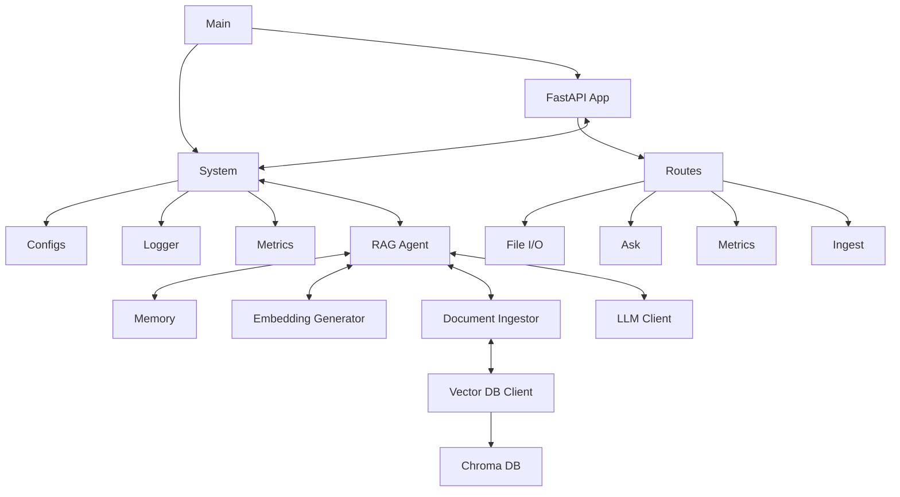

# Research Assistant
A light weight memory-augmented RAG application **Research Assistant** built with **FastAPI**, **Ollama**, **ChromaDB** and **Transformers**. Supports *Persistent Memory*, *Tooling* and *Docker Deployment*. **~800MB** final docker image size. 
# Running The App
**Make** configurations are available for running the app in **Docker**.
## Prerequisites
- **Docker** (Needed for using **Make** commands)
- **Make**
- **Ollama** (Optional)
- **Python 3** (Optional) 
- **LLM Module (.onnx)** (Needed to run using **LLAMA CPP**)

That's it. Build it and it can run **offline!**.

---
### Using Makefiles commands
 
```sh 
make run
```
Initiates a *docker compose* to run the app based on ***LLM Module*** *.env* flag.
 ```sh
 make run-with-container
```
This will install a separate container for **OLLAMA** and our app. They communicate internally. **Phi3** mini model is setup. *Entrypoint* scripts are setup and our app will wait for the *Ollama container* to be ready before starting the app. 

>[!NOTE]
>###### After creation the *Ollama container* will consume **~2.5G**.


```sh 
make stop
```
- Remove *docker containers* and any *startup script**
```sh
make clean
```
- Stop and remove docker *containers* and *images* including any *volume mounts* 
```sh 
make create
```
- Create a *docker image* *.tar* file for deployment.
>[!IMPORTANT]
>##### If you are using the *"run"*  command,  you need to ensure that app container can access the *OLLAMA* URL. For linux systems, this can be done by creating *config.toml* and adding the following in *$HOME_DIR/.ollama/config.toml* #####
```toml
[server]
listen = "0.0.0.0:11434"
```
---
### Running direct (Self Hosting)
You can also host the application locally. The project source code contains *requirements.txt* containing dependencies needed by the project.
- Create a *virtual env*	
  python -m venv .venv && source ./.venv/bin/activate
 - Install dependencies

 ```sh
 pip install -r requirements.txt
 ```
 - Tests are available and written with **pytest**. Install dev dependencies to run tests. **> 80% Coverage!**. Code quality ensured with **mypy**, **ruff** and **black**
 pip install -r dev-requirements.txt
 - Run the main module
  ```sh
  python -m main 
  ```
  **OR** 
  ```sh
  python ./main.py 
  ```
  (If you are on the *ROOT_DIR*)
 - System Logs are available in **/logs** folder.
##### To avoid any permissions issue, remove any */models* (models for llama cpp) or */chroma_db* (persistent vector storage) or /logs or /sample_data (has the documents to be searched) directories.

## Configurations

The project depends on user configurations. Use **.env** file to set configurations when running locally. 
**Makefile** commands internally use *docker compose* to setup containers. The environment variables can be set in 
***docker-compose.base.yaml***

#### Overview
- **LLM_BACKEND** - Responsible for switching backends!
- **LLAMA_CPP_MODEL_FILE** - A compatible LLM Model for **LLama CPP** if using this backend.
- **OLLAMA_CLIENT_URL** - If the **OLLAMA** backend is hosted in non-default url, can directly use it via this flag.

These flags are enough to switch backends and run the app.
There are other configurations (like deciding request timeout, context window etc). Check **.env.example** for available configs.


# System Architecture
This document outlines the system architecture for the application, including its main components and their interactions.

## System Diagram


## System Description

### Main ###
- The central entry point of the application. It can be run as module `python -m main`. If using *Makefiles*, will be used by *docker compose*.
---
### FastAPI App ###
- The API server `src/api/app.py`. Triggered by `main.py`
- Exposes REST endpoints via *routes*.
- View `Swagger UI` for exact EP and their schemas.
- Route files include:
  - `ASK` - Accepts natural language questions, calls RAG agent and returns responses.
  - `Ingest` - Triggers background ingestion of documents into vector DB.
  - `File I/O` - Includes file handling for uploaded documents which will be used by the agent during ask.
  - `Metrics` - Get usage stats.

>[!WARN]
> ###### By default, the *USE_TOOL* is set to *true*. So if `ASK` EPs are called before *Ingest*, will query context from **Wikipedia** instead.
---
### System ###
- Core utilities used across the app along with custom *RAG Agent* to orchestrate the flow.
- Includes:
**Configs `config.py`**: Loads env vars, defaults, model paths. Intialized prior to the API.
**Logger**: Implemented file-size based **Rotating Logs** using *logging* module. See `logger_config.py` for adjustments.
- **Metrics** Time/performance tracking using ***Prometheus*** hooks via *prometheus-client*. See `utils/metrics.py`

### Retrieval-Augmented Generation (RAG) Agent ###

#### Overview

The **RAGAgent** class (see `rag_agent.py`) orchestrates the full pipeline for answering user queries using contextually enriched retrieval-augmented generation. It integrates multiple components:

* A **vector store** (`VectorStoreClient`) to retrieve relevant documents
* An **LLM client** (`LLMClientBase`) to generate answers
* A **memory buffer** to maintain short-term conversation context
* An **embedding generator** to convert queries into vector representations
* An optional **tool runner** (implemented Wikipedia search here) for low-confidence results.

>[!IMPORTANT]
>###### The **TOOLING_THRESHOLD** *.env* (`0.0` to `1.0`) vairable controls the threshold below which any tool is run. (Score from ChromaDb (`0` to `2`) are normalized before comparing with the threshold).

#### Responsibilities

* Embed incoming queries using an ONNX-based encoder
* Retrieve top-k relevant chunks from ChromaDB
* Optionally fallback to a tool (Wikipedia) if confidence is low
* Construct a prompt using retrieved context + prior memory
* Call the LLM and return structured results (answer + sources)
* Store the turn in memory for continuity

#### Why Custom RAG Agent?

While  offer graph-based orchestration and plugin support:
* [x] Dependency-free approach and avoids over-engineering
* [x] Show-case the basic understanding of underlying RAG Principles rather than abstracting away with libraries and frameworks.
* [x] Rapid proto-typing
* [x] Custom class-based architecture gives us full control and testability

**Future Potential:**

* `LangGraph` can be integrated to define complex decision logic (e.g. even better control on when to use tools, multi-hop reasoning)
* `LangChain` may be used to chain retrievers, summarizers, and rankers
* These will be evaluated as feature requirements grow

>[!NOTE] 
>###### The custom RAG Agent orchestrates the following components which are key for the RAG Flow
---
### MemoryBuffer

#### Overview

The `MemoryBuffer` class holds a short-term history of conversation turns. It is used to maintain context across user queries. (See `memory_buffer.py`)

#### Features

* Configurable number of turns (`max_turns`)
* Trims oldest interactions to respect buffer size
* Provides formatted history for prompt injection

#### Example Output

```
User: What is AI?
Assistant: AI stands for Artificial Intelligence...

User: And what about AGI?
Assistant: AGI refers to Artificial General Intelligence...
```

---

### EmbeddingGenerator

#### Overview

`EmbeddingGenerator` is a singleton class that loads an ONNX model and tokenizer from disk to generate vector embeddings. These are used for document retrieval. (See `embedding_generator.py`)

#### Highlights

* Loads the embedding model (`MiniLM`, `all-MiniLM-L6-v2`, etc.) from a local ONNX model folder
* Uses HuggingFace tokenizer and ONNXRuntime session
* Performs mean pooling with attention mask to ignore padding
* Normalizes embeddings to unit length for cosine similarity

#### Why ONNX?

* High-performance inference even on CPU-only systems
* Small binary size (\~90MB for MiniLM)
* Reusable session instance across requests (singleton pattern)

>[!IMPORTANT]
> Originally tried embedding generation with **Sentence Transformer** module. But this caused the final docker image **~6.76G**. With this hugging face embedder and **Transformers** library, the final image size reduced by almost **9 times!**
---
### Vector DB Client

#### Overview

The `VectorStoreClient` class wraps access to the **ChromaDB** vector store. It provides an interface to insert, query, and delete vectorized document chunks. Supports **incremental upsers!** (can be adjust to *overwrite* instead with a *query param*. See `vector_store_client.py`)

#### Responsibilities

- Connects to ChromaDB via PersistentClient

- Creates/retrieves a named collection

- Supports vector-based retrieval, manual metadata filtering, and ID-based deletion

#### Key Methods

- `add_documents`: Ingests vectorized documents into the store

- `query`: Performs a text-based retrieval

- `query_by_vector`: Vector similarity search

- `delete_by_source`: Deletes all chunks for a given document filename

#### Future Ideas

- Add support for document tagging or versioning

- Extend with custom EmbeddingFunction adapters for hybrid retrieval
---

### LLMClient

#### Overview

The `LLMClient` class is controls the actual communication with an underlying LLM model like `Phi3`. The `LLMClientBase` abstract base class defines the unified interface for any LLM client backend. (See `llm_client_base.py`)

Project currently supports **Ollama** client and **Llama CPP**. The app supports **switchable backends!**. Also, each client is supports **streaming response!**.

Any specific LLM client must inherit from this ABC. It enforces the function:

>`generate(**kwargs) -> str`: Accepts prompts and returns a response (streaming or not)

##### OllamaClient
OllamaClient is a client wrapper that connects to a local Ollama server via its `/api/generate` HTTP API. (See `ollama_client.py`)

- Supports both *streaming* and *non-streaming* responses

- Automatically appends system_prompt if provided

- Gracefully handles JSON decoding issues

##### LlamaCppClient
LlamaCppClient wraps the native llama.cpp library (via llama-cpp-python) for ultra-efficient local inference using GGUF models.

- Supports *streaming* and *non-streaming* responses

* Can run fully offline using mmap/mlock memory access

###### Future Enhancements

- Add quantization-aware memory profiling

- Use n_batch config for large batch inferencing

- Add support for context persistence (e.g. KV cache reuse)
